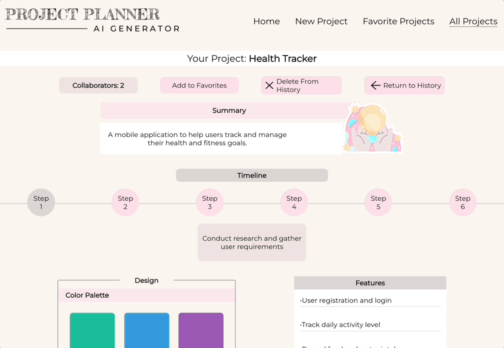

<h1> Project Planner</h1>
Unlock Creativity with AI: Your Infinite Source of Innovative Project Ideas

[DEPLOYED LINK](https://project-planner-ui.vercel.app/) 
[Link to Back-End Repo](https://project-planner-ui.vercel.app/)

Technologies used: 
  
  
  
  
  
   
  
  
  
  

## Abstract: 
Our Project Planning app is a groundbreaking solution, powered by advanced AI technology, designed to revolutionize the way you generate project ideas and plan them effectively. In a fast-paced world where innovation is paramount, finding the perfect project concept, assembling the right tech stack, and estimating timelines and resources can be an intimidating challenge. Our app simplifies this process by harnessing the power of AI to provide tailored project ideas based on the user's preferences and objectives.

# Preview of App:
 
 
  <h2>Filling Out the Form </h2>
  
  <h2>Viewing & Favoriting the Results</h2>
    
  <h2>Editing the Results</h2>
    
 

## Installation Instructions:
- Fork [this](https://github.com/AI-Project-Planner/project-planner-ui) repository. 
- Clone it to your local machine using the command: `git clone git@github.com:AI-Project-Planner/project-planner-ui.git`.
- Run the command: `cd project-planner-ui`
- Run the command: `npm install`
- Run the command: `npm start`
- To run Cypress e2e tests, run the command: `npm run cypress`
Note about Cypress: There are unstubbed network requests in all result page components due to the YouTube videos being displayed- these network requests are coming directly from YouTube so we were unable to intercept them.

## Context:
- All contributors are currently enrolled in the seven month long Front End Engineering program at Turing School of Software and Design. This project was created during the third module of the program, which has a total of four modules. 

## Contributors:
- [Laura Garcia Guerra](https://github.com/lauraguerra1)
- [Fernando Robles](https://github.com/fernandorobles97)
- [Saki Chatphatthanasiri](https://github.com/sakisandrac)

## Learning Goals:
- Improving communication and collaboration skills by working with a dedicated Back-End team.
- Gain proficiency in leveraging AI technology for enhanced functionality and efficiency in a project.
- Solidify knowledge and understanding of React and TypeScript fundamentals.
- Understanding continuous deployment principles and incorporating CircleCI into our project.